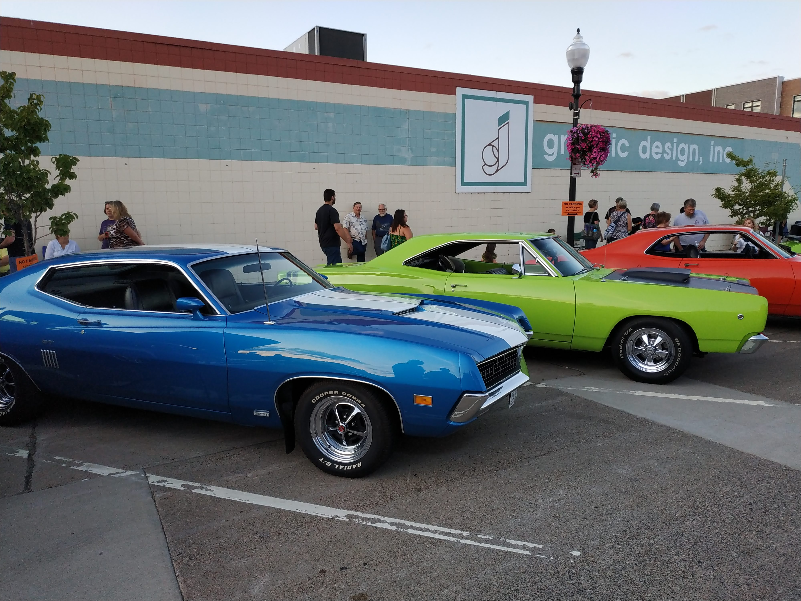
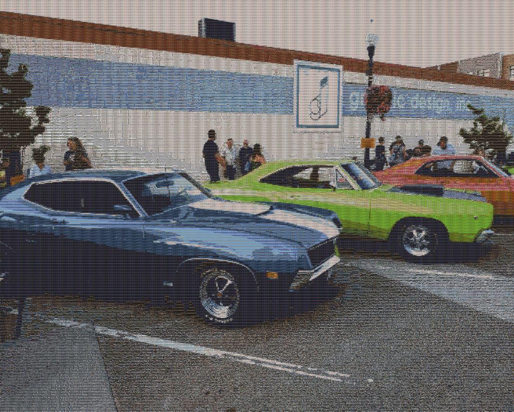
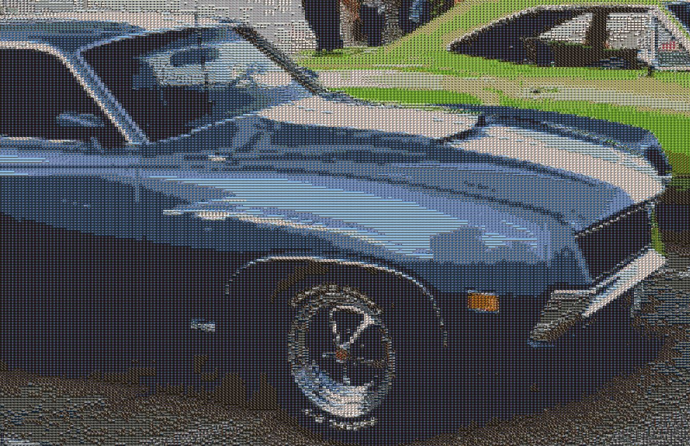
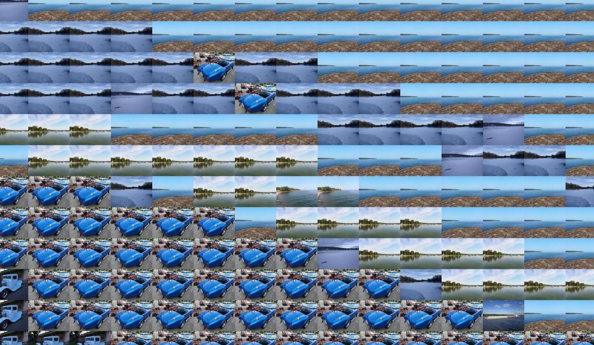

# Description
Create a photo mosaic based on a source image, by using other images as mosaic pieces.

Source image:
[](sample.jpg)

Result image, zoomed out:
[](zoomedout_result_sample.jpg)

Result image, zoomed in:
[](zoomed_in_result_sample.jpg)

Result image, actual size:
[](actual_size_result_sample.jpg)

## Quality of result
The quality of the mosaic depends on a number of factors:
- The number of images you have in your folder and their palette (i.e. ideally they should be various in color)
- The parameters with which the program is executed
  - Width of the source image sampling - drives how 'detailed' the mosaic will be. The smaller the number (min 10), the more detailed, but larger the output file would be.
  - Width of the mosaic image - drives how 'detailed' the mosaic images would be, when you zoom in the result image. The larger the width, the more detailed, but would also result in a much larger result file.

## Warning about size
Resulting image size and dimensions could be pretty large. A `3968px x 2976px` source image, processed with the default parameters of `-spx 20` and `-mpx 85` would result in a `16864px x 12499px` image, that's about `57Mb` in size.

What the parameters mean is that every `20` pixels in width (the height ratio is preserved) of the source image, would be replaced with `85` pixels wide mosaic image. In other words:
- source: `3968px / 20px = 198.4`
- result: `198.4 * 85px = 16864px`

You can easily get mosaic images in the size of hundreds of megabytes.

# Usage

## As script
The script takes the following command line arguments:

```
usage: Creates a mosaic from images.

optional arguments:
  -h, --help            show this help message and exit
  -s SOURCE_FILENAME, --source_filename SOURCE_FILENAME
                        The photo to create mosaic of. If not provided, will choose random from the library.
  -spx SOURCE_PIXELS, --source_pixels SOURCE_PIXELS
                        px width for source image sampling box (default: 20). Less creates a bigger and more clearn mosaic.
  -mpx MOSAIC_PIXELS, --mosaic_pixels MOSAIC_PIXELS
                        px width of mosaic piece box (default: 85). More creates bigger mosaic details, but will enlarge the result image.
  -l LIBRARY, --library LIBRARY
                        The path to folder of photos to use to make the mosaic.
```

### Examples
Generate a mosaic from a random photo found in the folder `C:\photos` and uses the folder `C:\photos` (which should contain images) as a library.
```
(.env) PS D:\PythonProjects\photomos> py photomos.py -l C:\photos
```

Generate a mosaic from the photo `C:\photos\sample.jpg` and uses the folder `C:\photos` (which should contain images) as a library.
```
(.env) PS D:\PythonProjects\photomos> py photomos.py -l C:\photos -s C:\photos\sample.jpg
```

## As module

### Examples
Generate a mosaic from a source image and a library, and show it.
```
from photomos import PhotoMosaic

photo_mosaic = PhotoMosaic()
result = photo_mosaic.create_mosaic("C:\\photos\\sample.jpg", "C:\\photos", 20, 85)
result.show()
```

Generate a mosaic from a source image and a library, and save it as `mosaic.jpg`.
```
from photomos import PhotoMosaic

photo_mosaic = PhotoMosaic()
result = photo_mosaic.create_mosaic("C:\\photos\\sample.jpg", "C:\\photos", 20, 85)
result.save("mosaic.jpg")

```

# Project technical features
- [tqdm](https://github.com/tqdm/tqdm) - progress bar
- [Pillow/PIL](https://github.com/python-pillow/Pillow) - image processing
- multiprocessing - parallel work on all CPUs

# TODO
- Library
  - Require minimum number of images?
  - Analyze spectrum completeness
  - Test with and support other image types
  - Threshold of distance, pick random within the group instead of the first one. If no appropriate image to replace with, replace with solid color?
- Respect image ratios and orientation
- Use Python installer and tkinter to create a stand-alone Windows application